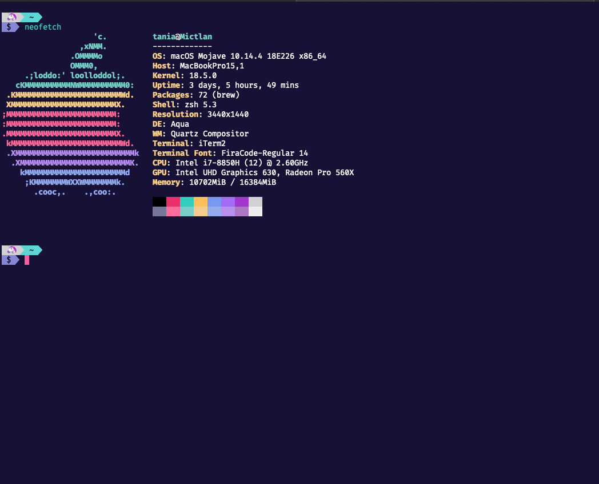
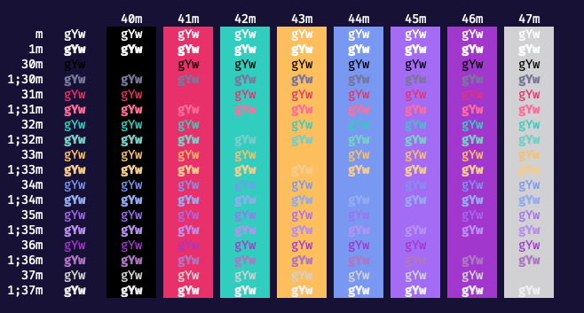
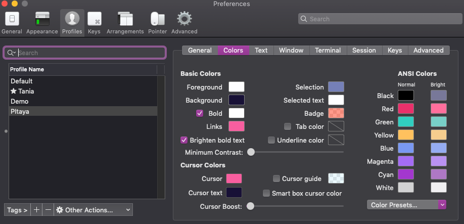

 

 

 

 

<table width='100%' align="center">
 <tr>
 <td align='left' width='100%' colspan='2'>
 <b>Pitaya Smoothie theme for iTerm2 </b>

 A professional theme with hand-picked & bold colours for iTerm2. The theme is heavily inspired by the <a href="https://www.pantone.com/color-intelligence/color-of-the-year/color-of-the-year-2018">Pantone colour of the year 2018</a> and the Outrun aesthetics.
 </td>
</table>

:sparkles: If you want to install the VS Code theme [visit the VS Code marketplace](https://marketplace.visualstudio.com/items?itemName=trallard.pitaya-smoothie&WT.mc_id=pitaya_smoothie-github-taallard) :sparkles:

## Installation 

1. [Download Pitaya Smoothie for iTerm2]()
2. Install [iTerm](https://www.iterm2.com/)
3. Press <kbd>Cmd</kbd> + <kbd>,</kbd> to open preferences
4. Visit profiles -> [Your profile] -> Colors
5. Choose `Import` from the `Color presets` drop-down
6. Import the `pitaya_smoothie.itermcolors` file
7. Choose `pitaya smoothie` from the color presets

## Snapshots 

## Preferences shown in the previews 

The cursor and link colours used is `#f85e9f` and I changed the selection colour to match the VS Code theme too `#7580b8`.

I also use the Fira Code Font with ligatures enabled.

## Contributing 

🚧 This project is always a work in progress, and everyone is welcome and encouraged to collaborate in it. 🚧

Everyone should follow our [code of conduct](./CODE_OF_CONDUCT.md) and to check out our [contributing guidelines](CONTRIBUTING.md) for more information on how to get started.

<!-- TODO: add snapshots -->

## Pitaya Smoothie in other places 

- Iterm theme [https://github.com/trallard/pitaya_smoothie_iterm](https://github.com/trallard/pitaya_smoothie_iterm)

## License 

**Licensed** as BSD-3 ⓒ [Tania Allard](https://bitsandchips.me/).

## Attributions 

- Icons made by <a href="https://www.flaticon.com/authors/freepik" title="Freepik">Freepik</a> from <a href="https://www.flaticon.com/" title="Flaticon">www.flaticon.com</a> and adapted to match the theme's colours.

- The logo font is Attractype Reborn from [Garisman Studio](https://befonts.com/designer/garisman-studio).
